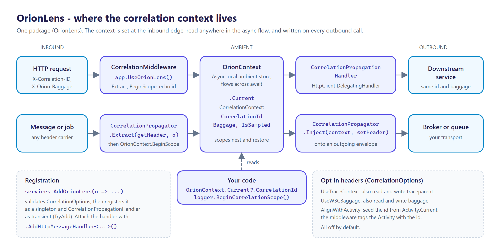
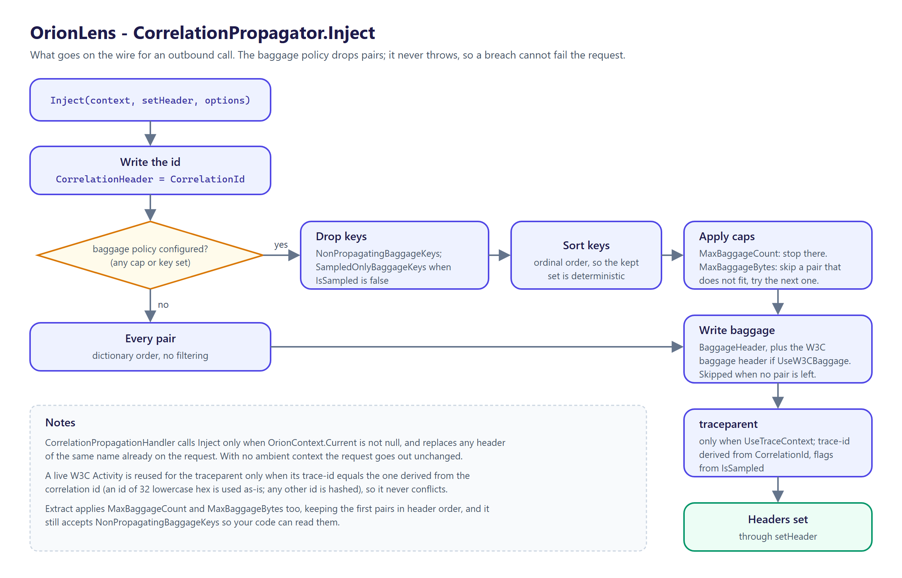

<p align="center">
  <picture>
    <source media="(prefers-color-scheme: dark)" srcset="docs/logo.png">
    
  </picture>
</p>

# OrionLens

[](https://github.com/tunahanaliozturk/OrionLens/actions/workflows/ci-cd.yml)
[](https://www.nuget.org/packages/OrionLens/)
[](LICENSE)


Ambient correlation context for .NET. One correlation id, plus a little baggage, is established at
the edge of a request and flows through every `await` and across every downstream HTTP call, so a
single logical operation is traceable end to end without threading an id through every method
signature.

Part of the **Orion** family. Usable entirely on its own.



---

## Why

When a request fans out across services, you want one id stitching the logs together. Passing it
explicitly everywhere is noise; stuffing it in a `[ThreadStatic]` breaks the moment you cross an
`await`. OrionLens uses `AsyncLocal` so the context follows the logical flow, reads and writes it on
the HTTP boundary for you, and keeps the data model immutable so a nested scope can add baggage
without disturbing its parent.

---

## Features

- **Ambient context over `AsyncLocal`.** `OrionContext.Current` is available anywhere in the async
  call chain with no parameter passing. Scopes nest and restore exactly on dispose.
- **Immutable context model.** `CorrelationContext` carries a correlation id and a frozen baggage
  dictionary. `WithBaggage` returns a new instance, so a child scope never mutates its parent.
- **HTTP-agnostic propagation.** `CorrelationPropagator.Extract` / `Inject` work against any header
  getter and setter, so the same logic serves an ASP.NET request, an `HttpClient` request, or a
  message envelope.
- **ASP.NET Core middleware.** `UseOrionLens()` establishes the context per request, mints an id
  when one is missing, and echoes it back on the response.
- **Outbound `HttpClient` handler.** `CorrelationPropagationHandler` injects the ambient context
  into every outbound request, so downstream services receive the same id and baggage.
- **W3C trace-context bridge.** When `UseTraceContext` is enabled, the correlation id is aligned with
  the W3C `traceparent` so the correlation id and the distributed trace id line up across systems. On
  extract, an inbound `traceparent` trace-id becomes the correlation id when no id header is present;
  on inject, a `traceparent` is emitted whose trace-id is derived from the correlation id, so it never
  conflicts with `X-Correlation-ID`.
- **Logging enrichment helpers.** `ILogger.BeginCorrelationScope()` pushes the correlation id (and
  selected baggage) into a logging scope, so structured logs carry it without a manual `BeginScope` at
  every log site. Builds only on the logging abstractions and binds no logging sink.
- **Baggage policy.** Optional caps on baggage count (`MaxBaggageCount`) and encoded size
  (`MaxBaggageBytes`), and inbound-only keys (`NonPropagatingBaggageKeys`) that are read on extract but
  never emitted on inject, so headers stay small and internal values do not cross a trust boundary.
- **Activity integration.** When `AlignWithActivity` is enabled, the correlation id seeds from the
  current `Activity`'s trace-id when no id header is present, and the id (plus opted-in
  `ActivityBaggageKeys`) is projected onto the current `Activity` as a tag and baggage, so OrionLens
  and `Activity`-based tracing agree on the identifier. It never starts a span.
- **Sampling-aware correlation.** `CorrelationContext.IsSampled` carries the head-based sampling
  decision (from the `Activity` recorded flag or the inbound `traceparent`). `SampledOnlyBaggageKeys`
  lets heavier diagnostic baggage ride only sampled traces; the correlation id always propagates for
  logging regardless.
- **W3C `baggage` interop.** When `UseW3CBaggage` is enabled, the standard `baggage` header is read and
  written alongside `X-Orion-Baggage`, with the baggage policy applied to both so non-propagating keys
  stay off either header.
- **No third-party dependencies.** The core targets `net8.0`, `net9.0`, and `net10.0`; the ASP.NET
  Core surface uses only the shared framework.

---

## Install

```bash
dotnet add package OrionLens
```

---

## Quick start

Establish context on the way in, propagate it on the way out:

```csharp
using Moongazing.OrionLens;
using Moongazing.OrionLens.Http;

builder.Services.AddOrionLens(o => o.CorrelationHeader = "X-Correlation-ID");

// outbound: attach the handler to any client that calls a downstream service
builder.Services.AddHttpClient("downstream")
    .AddHttpMessageHandler<CorrelationPropagationHandler>();

var app = builder.Build();
app.UseOrionLens();   // early, before logging and downstream calls

app.Run();
```

Read the context anywhere, with no parameter passing:

```csharp
using Moongazing.OrionLens.Context;

var id = OrionContext.Current?.CorrelationId;
logger.LogInformation("Processing order {OrderId} for correlation {Correlation}", orderId, id);

var tenant = OrionContext.Current?.GetBaggage("tenant");
```

---

## Usage

### Baggage: add and read

Baggage is a small set of `key=value` string pairs carried alongside the id (a tenant id, a feature
flag). The context is immutable, so adding a pair produces a new context; open a scope over it so
the rest of the flow sees it and the previous context is restored on dispose:

```csharp
using Moongazing.OrionLens.Context;

var current = OrionContext.Current!;

using (OrionContext.BeginScope(current.WithBaggage("tenant", tenantId)))
{
    // everything in here sees the tenant baggage
    var tenant = OrionContext.Current!.GetBaggage("tenant");   // tenantId
    await next();
}
// outside the using, the baggage is gone again
```

You can also build a context from scratch, for example at the start of a background job:

```csharp
var context = CorrelationContext.Create(Guid.NewGuid().ToString("N"))
    .WithBaggage("job", "nightly-reconcile");

using (OrionContext.BeginScope(context))
{
    await RunJobAsync();
}
```

`GetBaggage` returns `null` for an absent key; `Baggage` exposes the whole set as a read-only
dictionary.

### Propagation across HTTP

The middleware reads the inbound headers and the `CorrelationPropagationHandler` writes the outbound
ones. The defaults:

| Field          | Header (default)   | Notes                                                          |
|----------------|--------------------|----------------------------------------------------------------|
| Correlation id | `X-Correlation-ID` | Read inbound, minted if absent, echoed on the response         |
| Baggage        | `X-Orion-Baggage`  | `key=value` pairs joined by commas, each part percent-encoded  |

The handler injects only when there is an ambient context; with no context, the outbound request
carries no correlation headers.


When a request arrives without an id header, `Extract` falls back in a fixed order:


### Propagation without ASP.NET

The core (`CorrelationContext`, `OrionContext`, `CorrelationPropagator`) has no HTTP dependency.
`Extract` and `Inject` work against any header getter and setter, so you can carry context across a
message queue or any transport that has headers:

```csharp
using Moongazing.OrionLens;
using Moongazing.OrionLens.Context;

var options = new CorrelationOptions();

// inbound: build a context from a message envelope's headers
var context = CorrelationPropagator.Extract(
    name => envelope.Headers.TryGetValue(name, out var v) ? v : null,
    options);

using (OrionContext.BeginScope(context))
{
    await HandleMessageAsync();
}

// outbound: write the current context onto a new envelope
CorrelationPropagator.Inject(
    OrionContext.Current!,
    (name, value) => outgoing.Headers[name] = value,
    options);
```

### W3C trace-context bridge

Set `UseTraceContext` to align the correlation id with the W3C `traceparent`, so the correlation id
and the distributed trace id are the same value across systems. It is off by default, so behaviour is
unchanged until you opt in:

```csharp
builder.Services.AddOrionLens(o => o.UseTraceContext = true);
```

With it on, `Extract` and `Inject` also read and write the `traceparent` header:

- On **extract**, when there is no `X-Correlation-ID` and the inbound `traceparent` carries a valid
  32-hex trace-id, that trace-id becomes the correlation id. An explicit `X-Correlation-ID` still
  wins, so the trace-id is only adopted when no id header is present.
- On **inject**, a `traceparent` is emitted whose trace-id is derived from the correlation id (an id
  that is already 32 lowercase hex characters is used as-is; any other id is hashed into a stable
  trace-id). A live `Activity` is reused only when its trace-id already matches the one the
  correlation id maps to, so the emitted `traceparent` never conflicts with `X-Correlation-ID`.

```csharp
using Moongazing.OrionLens;
using Moongazing.OrionLens.Context;

var options = new CorrelationOptions { UseTraceContext = true };

// inbound carrying only a traceparent: its trace-id becomes the correlation id
var context = CorrelationPropagator.Extract(
    name => inbound.TryGetValue(name, out var v) ? v : null,
    options);

// outbound: Inject writes X-Correlation-ID and an aligned traceparent
CorrelationPropagator.Inject(
    context,
    (name, value) => outgoing[name] = value,
    options);
```

The trace header name is configurable through `TraceParentHeader` (default `traceparent`).

### Logging enrichment

`ILogger.BeginCorrelationScope()` opens a logging scope carrying the ambient correlation id, so every
log written inside the `using` carries it without a manual `BeginScope` at each call site. The helper
builds only on `Microsoft.Extensions.Logging.Abstractions` and binds no logging sink, so it works with
any provider that honours scopes. It returns null when no context is established, so a bare `using`
over the result is safe:

```csharp
using Moongazing.OrionLens.Logging;

using (logger.BeginCorrelationScope())
{
    logger.LogInformation("Handling order");   // scope carries CorrelationId
}
```

To enrich selected baggage as well, opt keys in through `LoggedBaggageKeys` and pass the options. Only
the named keys reach the scope, so internal or high-cardinality values stay out of logs unless you opt
them in:

```csharp
var options = new CorrelationOptions();
options.LoggedBaggageKeys.Add("tenant");

using (logger.BeginCorrelationScope(options))
{
    logger.LogInformation("Handling order");   // scope carries CorrelationId and tenant
}
```

An overload takes an explicit `CorrelationContext`, for a background job or a message consumer that
holds a context directly rather than through the ambient scope.

### Baggage policy

Baggage policy keeps propagated headers small and stops internal values from crossing a trust
boundary. It is enforced on both `Extract` and `Inject`, and breaches are handled by dropping pairs,
never by throwing, so a policy breach cannot fail a live request. With nothing configured (the
default), baggage propagates exactly as before.

```csharp
builder.Services.AddOrionLens(o =>
{
    o.MaxBaggageCount = 8;                       // at most 8 baggage pairs cross a boundary
    o.MaxBaggageBytes = 1024;                    // at most 1024 bytes of encoded baggage header
    o.NonPropagatingBaggageKeys.Add("internal"); // read inbound, never written outbound
});
```

- `MaxBaggageCount` and `MaxBaggageBytes` cap the pair count and the encoded header size. On
  `Inject`, pairs are considered in ordinal key order, so the kept set is deterministic; a pair that
  would overflow `MaxBaggageBytes` is skipped and later, smaller pairs may still fit. On `Extract`,
  parsing stops at the cap, so the first pairs in header order are kept.
- `NonPropagatingBaggageKeys` marks keys inbound-only: such a key is still readable after `Extract`,
  but it is never written on `Inject`.
- `SampledOnlyBaggageKeys` marks keys that `Inject` writes only when the context is sampled
  (`CorrelationContext.IsSampled`); see [Activity integration and sampling](#activity-integration-and-sampling).



### Activity integration and sampling

Set `AlignWithActivity` to make OrionLens and `System.Diagnostics.Activity`-based tracing agree on
the identifier. It is off by default and never starts a span:

```csharp
builder.Services.AddOrionLens(o =>
{
    o.AlignWithActivity = true;
    o.ActivityBaggageKeys.Add("tenant");          // copied onto Activity baggage
    o.SampledOnlyBaggageKeys.Add("debug-trace");  // propagated only on sampled traces
});
```

- On **extract**, when no id header is present and a W3C `Activity` is current, its trace-id becomes
  the correlation id (ahead of an inbound `traceparent`).
- In the **middleware**, the correlation id is written onto `Activity.Current` as the tag named by
  `ActivityCorrelationTag` (default `orion.correlation_id`), and the keys in `ActivityBaggageKeys` are
  copied onto the activity's baggage when it does not already carry them. Hosts without the middleware
  call `OrionTraceContextScope.AlignCurrentActivity(context, tag, keys)` directly.
- `CorrelationContext.IsSampled` carries the head-based sampling decision, read on extract from the
  current `Activity`'s recorded flag (with `AlignWithActivity`) or the inbound `traceparent` flags
  (with `UseTraceContext`); otherwise it is `true`. A derived outbound `traceparent` reflects it.

### W3C `baggage` interop

Set `UseW3CBaggage` to read and write the standard `baggage` header (`W3CBaggageHeader`) alongside
`X-Orion-Baggage`. On extract, the custom header wins on a key collision; on inject, the same
policy-filtered value is written to both headers. Off by default:

```csharp
builder.Services.AddOrionLens(o => o.UseW3CBaggage = true);
```

### ASP.NET Core middleware

`UseOrionLens()` adds `CorrelationMiddleware` to the pipeline. Place it early, before anything that
logs or makes downstream calls, so the ambient context is established for the whole request. The
middleware extracts the inbound id and baggage, makes them current for the rest of the pipeline, and
(when `WriteResponseHeader` is set) writes the id back on the response before the body starts, so the
caller sees it even on an error response.

With `UseTraceContext` set, the middleware opens the scope through
`OrionTraceContextScope.BeginTraceLinkedScope` instead of `OrionContext.BeginScope`. When a W3C
`Activity` is already current (ASP.NET Core usually starts one per request when tracing is enabled), the
correlation id is reconciled to that activity's trace-id, and that is the id echoed on the response
and propagated downstream. When none is current, an activity is started from
`OrionTraceContextScope.Source` (`Moongazing.OrionLens`) with a trace-id derived from the correlation
id.

---

## Configuration

`AddOrionLens` takes an optional `Action<CorrelationOptions>`. Options are validated eagerly at
registration, so an empty header name throws right away rather than failing at the first request.

```csharp
builder.Services.AddOrionLens(o =>
{
    o.CorrelationHeader = "X-Correlation-ID";   // inbound/outbound id header
    o.BaggageHeader = "X-Orion-Baggage";        // inbound/outbound baggage header
    o.GenerateIdWhenMissing = true;             // mint a new id when inbound has none
    o.MissingIdSentinel = "";                   // id used when generation is off and none arrives
    o.WriteResponseHeader = true;               // echo the id on the response
    o.UseTraceContext = true;                   // bridge the id to the W3C traceparent
    o.TraceParentHeader = "traceparent";        // trace-context header name
    o.AlignWithActivity = true;                 // seed from / project onto Activity.Current
    o.ActivityCorrelationTag = "orion.correlation_id"; // Activity tag carrying the id
    o.ActivityBaggageKeys.Add("tenant");        // baggage keys copied onto Activity baggage
    o.UseW3CBaggage = true;                     // also read and write the W3C baggage header
    o.W3CBaggageHeader = "baggage";             // W3C baggage header name
    o.SampledOnlyBaggageKeys.Add("debug");      // baggage keys propagated only when sampled
    o.MaxBaggageCount = 8;                       // cap baggage pair count (null = no cap)
    o.MaxBaggageBytes = 1024;                    // cap encoded baggage size (null = no cap)
    o.NonPropagatingBaggageKeys.Add("internal"); // inbound-only baggage keys
    o.LoggedBaggageKeys.Add("tenant");           // baggage keys the log scope helpers include
});
```

| Option                  | Type     | Default            | Meaning                                                                                                   |
|-------------------------|----------|--------------------|-----------------------------------------------------------------------------------------------------------|
| `CorrelationHeader`     | `string` | `X-Correlation-ID` | Header carrying the correlation id, read inbound and written outbound.                                     |
| `BaggageHeader`         | `string` | `X-Orion-Baggage`  | Header carrying baggage as percent-encoded `key=value` pairs joined by commas.                             |
| `GenerateIdWhenMissing` | `bool`   | `true`             | When true, an inbound request without an id (and no trace-id to adopt) is given a freshly generated one; when false, it gets `MissingIdSentinel`. |
| `MissingIdSentinel`     | `string` | `""`               | The id used when `GenerateIdWhenMissing` is false and no id arrives. Empty by default, so the missing id is taken verbatim; set e.g. `"unknown"` for a non-empty placeholder. Must not be null. |
| `WriteResponseHeader`   | `bool`   | `true`             | When true, the middleware echoes the correlation id back on the response.                                 |
| `UseTraceContext`       | `bool`   | `false`            | When true, aligns the correlation id with the W3C `traceparent`: adopts an inbound trace-id when no id header is present and emits a `traceparent` derived from the id on inject. |
| `TraceParentHeader`     | `string` | `traceparent`      | Header carrying the W3C trace context, read on extract and written on inject when `UseTraceContext` is set. |
| `AlignWithActivity`     | `bool`   | `false`            | When true, an absent id is seeded from the current W3C `Activity`'s trace-id, the sampling decision is read from it, and the middleware writes the id (and `ActivityBaggageKeys`) onto it. Never starts a span. |
| `ActivityCorrelationTag` | `string` | `orion.correlation_id` | Tag key for the correlation id on the current `Activity` when `AlignWithActivity` is set. |
| `ActivityBaggageKeys`   | `ISet<string>` | empty        | Baggage keys copied onto the current `Activity`'s baggage when `AlignWithActivity` is set. |
| `UseW3CBaggage`         | `bool`   | `false`            | When true, the standard W3C `baggage` header is read and written alongside `BaggageHeader`, with the same policy applied to both. |
| `W3CBaggageHeader`      | `string` | `baggage`          | The W3C baggage header name used when `UseW3CBaggage` is set. |
| `SampledOnlyBaggageKeys` | `ISet<string>` | empty       | Baggage keys written on inject only when the context is sampled (`IsSampled`). A key also in `NonPropagatingBaggageKeys` never propagates. |
| `MaxBaggageCount`       | `int?`   | `null`             | Maximum baggage pairs that cross a boundary; over the cap, pairs are dropped (in ordinal key order on inject, after the first pairs in header order on extract). `null` means no cap. Must be greater than zero when set. |
| `MaxBaggageBytes`       | `int?`   | `null`             | Maximum encoded baggage header size in bytes; over the cap, pairs are dropped (on inject a pair that does not fit is skipped and later pairs may still fit; on extract parsing stops). `null` means no cap. Must be greater than zero when set. |
| `NonPropagatingBaggageKeys` | `ISet<string>` | empty      | Baggage keys read on extract but never written on inject, so an internal value does not cross a trust boundary. |
| `LoggedBaggageKeys`     | `ISet<string>` | empty          | Baggage keys (besides the correlation id) that the logging enrichment helpers push into a logging scope. |

`AddOrionLens` registers the resolved `CorrelationOptions` as a singleton and
`CorrelationPropagationHandler` as transient, so the handler is ready to attach to any named or typed
`HttpClient`.

---

## Testing

The library ships with a test suite covering the immutable context, the ambient store (nesting and
async-flow restore), the propagator (extract, generate-when-missing, round-trip, baggage encoding),
the ASP.NET Core middleware, the outbound handler, DI registration, logging enrichment, the baggage
policy, `Activity` integration and W3C baggage interop:

```bash
dotnet test
```

`tests/Moongazing.OrionLens.AotSmoke` is a small console app that CI publishes with NativeAOT to keep
the correlation context trim- and AOT-safe.

Micro-benchmarks for the in-memory hot paths live under `benchmarks/Moongazing.OrionLens.Benchmarks`
and are documented in [benchmarks.md](benchmarks.md). No measured numbers are committed; run them on
your own hardware.

---

## Versioning

OrionLens follows [Semantic Versioning](https://semver.org/spec/v2.0.0.html). Notable changes are
recorded in [CHANGELOG.md](CHANGELOG.md).

---

## Documentation

- [docs/FEATURES.md](docs/FEATURES.md) - a deeper breakdown of every public type and how it behaves.
- [docs/ROADMAP.md](docs/ROADMAP.md) - ideas under consideration (not promises).
- [benchmarks.md](benchmarks.md) - what the micro-benchmarks measure and how to run them.
- [SECURITY.md](SECURITY.md) - how to report a vulnerability privately.

---

## More from the Orion family

OrionLens is one of a set of standalone .NET libraries:

- [OrionGuard](https://github.com/tunahanaliozturk/OrionGuard) - guard clauses and validation.
- [OrionAudit](https://github.com/tunahanaliozturk/OrionAudit) - automatic EF Core change-audit trail.

---

## Contributing

Issues and pull requests welcome. Please read [CONTRIBUTING.md](CONTRIBUTING.md) and the
[Code of Conduct](CODE_OF_CONDUCT.md) before opening one.

## License

This project is licensed under the [MIT License](LICENSE).

## Author

**Tunahan Ali Ozturk** - [GitHub](https://github.com/tunahanaliozturk)
